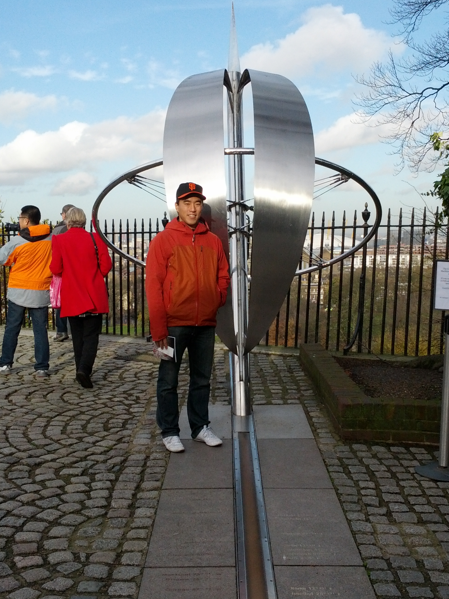
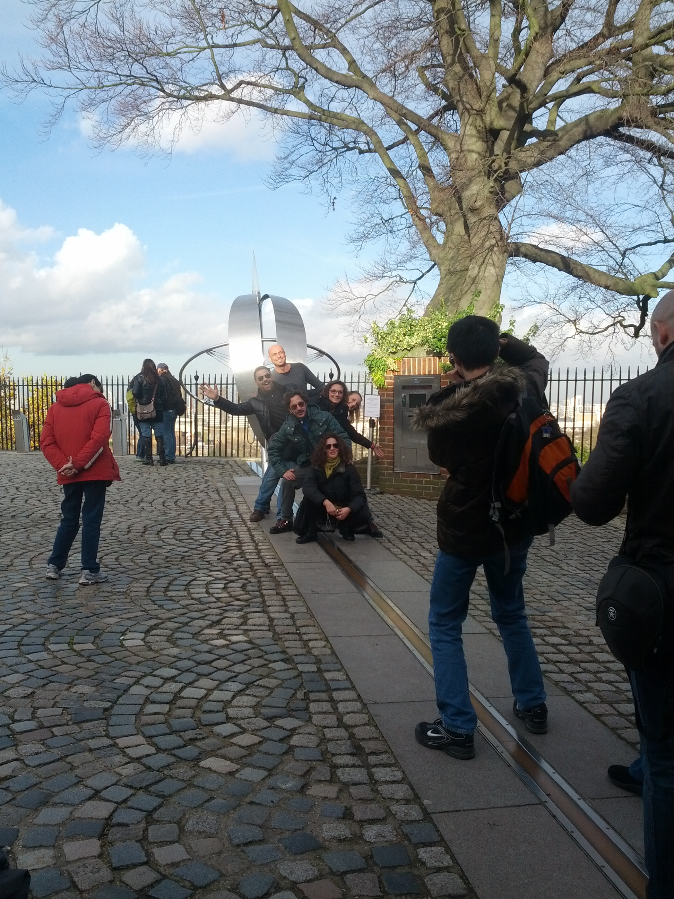
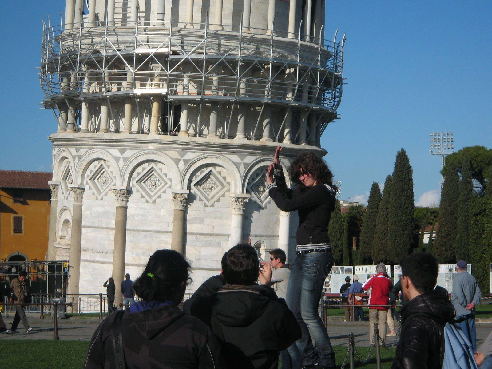

<style>
h2 { 
 color: #3399ff;		
}
h3 { 
 color: #3399ff;		
}
slides > slide.backdrop {
  background: white;
}
</style>

```{r setup, include=FALSE}
knitr::opts_chunk$set(echo = TRUE)
library(ggplot2)
library(dplyr)
library(tidyr)
```


## UTC

**Coordinated Universal Time** (UTC) is the primary time standard by which the
world regulates clocks and time.

* It is within about 1 second of mean solar time at 0° longitude
* It does not observe daylight saving time. 
* It is one of several closely related successors to Greenwich Mean Time (GMT).

Click [here](http://www.worldtimeserver.com/current_time_in_UTC.aspx)


## Royal Observatory in London

All hail Greenwich Mean Time at Longitude 0&deg;!




## Royal Observatory in London

Part of my series "Tourists taking clichéd tourist photos"




## Tourists Taking Clichéd Tourist Photos

