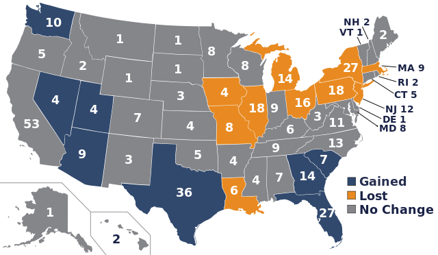

<style>
h2 { 
 color: #3399ff;		
}
h3 { 
 color: #3399ff;		
}
slides > slide.backdrop {
  background: white;
}
</style>

```{r setup, include=FALSE}
knitr::opts_chunk$set(echo = TRUE)
library(ggplot2)
library(dplyr)
library(tidyr)
```


## Recall: sp Package

The `sp` package has tools for loading/storing **vector** data in R. `sp` stands for `SpatialPolygons`


## Road Map

> * **Last time**: We are given a `SpatialPolygonsDataFrame` object, which we convert to tidy data format using `broom::tidy()` so we can `ggplot()` it
> * **Today**: We are given **shapefiles**, which we import into R to a `SpatialPolygonsDataFrame` object, which we convert ...


## Today's Goal

A [Choropleth Map](https://en.wikipedia.org/wiki/Choropleth_map) of Vermont county populations based on 2010 Decennial Census counts. We'll need

1. The `rgdal` package: To import shapefiles into R as a `SpatialPolygonsDataFrame` object. See `Lec16.R`
1. Social Explorer: To download census data. See instructions on lecture page.


## Shapefiles

A Geographic Information Systems (GIS) shapefile is a popular geospatial vector data format. It is developed and regulated by Esri as a (mostly) open specification for data interoperability among Esri and other GIS software products.

An all alternative format is GeoJSON files, which you can import into R using ROpenSci's [geojson](https://github.com/ropensci/geojson) package.


## Shapefiles

A shapefile has three mandatory files:

1. `.shp` — shape format; the feature geometry itself
1. `.shx` — shape index format; a positional index
1. `.dbf` — data about the geographic objects

Sometimes also

1. `.prj` — information on the coordinate system/projection format used. Examples:
    + [Universal Transverse Mercator (UTM)](https://en.wikipedia.org/wiki/Universal_Transverse_Mercator_coordinate_system)
    + [World Geodetic System (WGS)](https://en.wikipedia.org/wiki/World_Geodetic_System)


## Next, the Census

Article I, Section 2 of the US Constitution states:  *The actual Enumeration shall be made within three Years after the first Meeting of the Congress of the US, and within every subsequent Term of ten Years...*

i.e. there is **no sampling**, it is an exhaustive count.


## Census

The purpose of census is congressional apportionment: the 435 seats in the US House of Representatives get distributed proportionally to their population. After the 2010:




## Census vs American Community Survey

> * The census only tracks limited info: population split by age, gender, race,
household info.
> * The American Community Survey (ACS) however tracks more information, but we only have
**estimates** of quantities, not exhaustive counts: including income and poverty.


